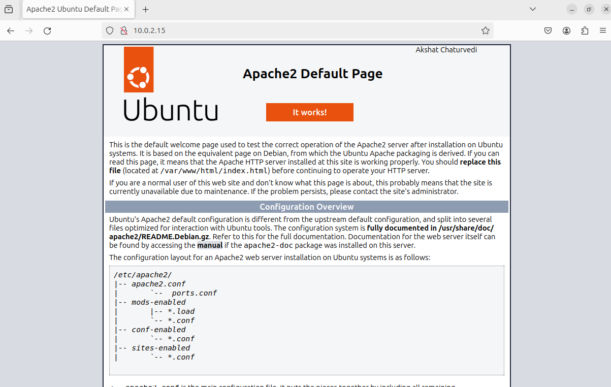
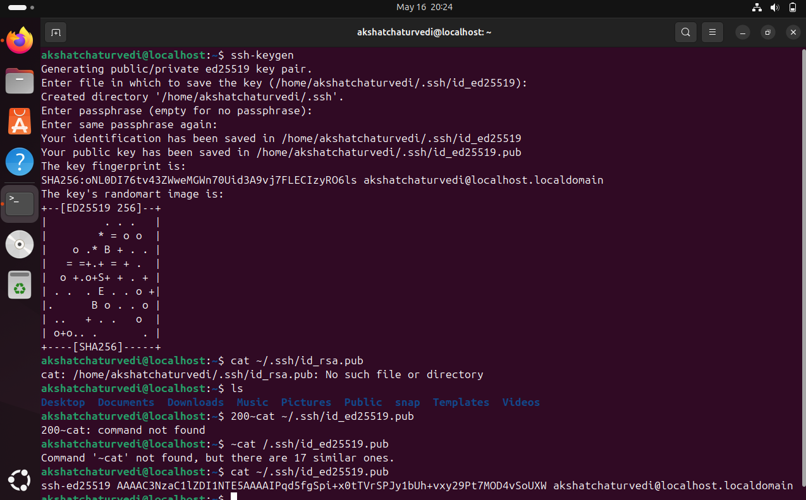

# WAPH-Web Application Programming and Hacking

## Instructor: Dr. Phu Phung

## Student

**Name**: Akshat Chaturvedi

**Email**: chaturat@mail.cu.edu

**Short-bio**: I have a keen interest in web development and data science.

### LabReport
In this lab I did the following:

1.Download and Install VirtualBox
2.Download Ubuntu 22.04 ISO
3.Create a New Virtual Machine:
4.Open VirtualBox and click on "New".
5.Allocate memory (at least 2048 MB recommended).
6.Create a virtual hard disk (VDI) and allocate at least 20 GB of storage.
7.Install Ubuntu:
8.Start the VM and select the downloaded Ubuntu ISO as the startup disk.
9.Follow the on-screen instructions to install Ubuntu, including setting up your user account and password.
10.Update and Upgrade Ubuntu:
11.Open the terminal and run sudo apt update and sudo apt upgrade to ensure the system is up-to-date.
12.Install Essential Software:
Used the following commands:
13.Install Git: sudo apt install git
14.Install Apache: sudo apt install apache2
15.Followed instructions to create appropriate readme.md file and took necessarcy screenshots.

## Repository Information

Respository's URL: [https://github.com/Akshat3960/waph](https://github.com/Akshat3960/waph)

This is a private repository for Phu Phung to store all code from the course. The organization of this repository is as follows.

### Labs 

 

  

