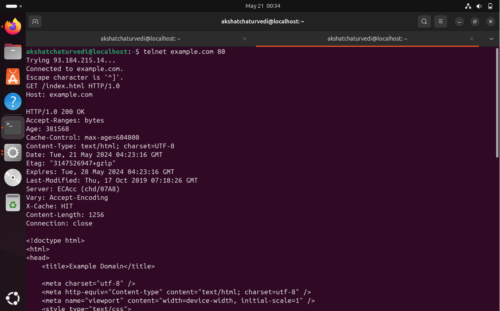

# WAPH-Web Application Programming and Hacking

## Instructor: Dr. Phu Phung

## Student

**Name**: Akshat Chaturvedi

**Email**: chaturat@mail.uc.edu

**Short-bio**: I have a keen interest in web development and data science.

## Repository Information 
**Repository-URL**: https://github.com/Akshat3960/waph-chaturat 
## Lab1
**Lab Overview**: In this lab I had the chance to use technologies like wireshark and telnet firsthand in this lab. I was able to collect packets and examine requests and responses with the use of wireshark and telenet. I now have a better understanding of http thanks to this exercise. I also gained knowledge in web application programming and CGI. I used C to create a simple online application, then I translated the code to CGI. In addition, we used PHP to create a web application that included user input. Finally, I was able to comprehend get and post requests more clearly. 

### Part 1
#### Task1:
**Familiar with the wireshark tool and HTTP Protocol**: In this lab, I examined the HTTP protocol using Wireshark.For instance, I launched a live capture at http://example.com/index.html then ended it. I examined the response to the GET request for /index.html. After that, I followed the HTTP stream to witness the complete client-server conversation. The necessary screenshots are as follows:
#### Image 1: Get Request

#### Image 2: Get Response

#### Task2:
**Understanding HTTP using Telnet and Wireshark**: Using Wireshark and telnet, I learned about HTTP in Task 2. I manually established a telnet connection and sent example.com a straightforward HTTP request. I recorded the HTTP traffic using Wireshark while I was making the request. I was able to understand HTTP fundamentals and browser complexities better by researching this procedure. These three screenshots are necessary:

#### Image1: Request and Response from the server

#### Image2: Request message in wireshark

#### Image3: Response

### Part2
#### Task1:
**a)**: I built the C program Helloworld.c to generate a "Hello World" CGI program. It printed the message "Hello World CGI! From Akshat Chaturvedi, WAPH". I used gcc to compile the code, and to accomplish this, I turned on Apache's CGI module, dropped the built program to /usr/lib/cgi-bin, and checked that it worked by opening a web browser and going to http://localhost/cgi-bin/Helloworld.cgi. To illustrate, here is the screenshot:

**b)**: To deploy the code, I first copied the file in the same folder and named it as index.c. Then, I modified the program and inside the printf command, I had written the HTML code. After it, I converted it into the cgi file and opened it in the browser after which I had written the command,"localhost/cgi-bin/index.cgi" and then got the output as shown in the image below.

​
Chaturvedi, Akshat (chaturat)
​
##### #include <stdio.h>
 
#### int main(void) {
    printf("Content-Type: text/html; charset=utf-8\n\n");
    printf("<!DOCTYPE html>\n"
           "<html>\n"
           "<head>\n"
           "<title>WAPH Lab 1 Akshat Chaturvedi</title>\n"
           "</head>\n"
           "<body>\n"
           "<h1>Akshat Chaturvedi</h1>\n"
           "<h2>EECE4005 - Web Application Programming and Hacking</h2>\n"
           "
 Akshat Chaturvedi
\n"
           "
Hi,my name is Akshat Chaturvedi and I like play cricket\n"
           "</body>\n"
           "</html>\n");
 
    return 0;
}

#### Task2:
**a)**: Installing PHP and making a helloworld.php file in my lab1 folder was my initial step. After that, I copied and pasted the given code and deployed file to the six root directory of the webserver. I checked the file's functionality in the browser once it was deployed to make sure it was up to level.

**b)**: I typed the command HTTP-POST http://localhost/echo.php-d "data=Hello, from akshat" on the terminal to test echo.php using an HTTP POST request with curl. The echoed data was shown in the response. I simultaneously ran Wireshark to capture packets while this was going on. Wireshark then recorded the HTTP requests and displayed the data that was delivered and received. I believe that one of the application's security threats is the possibility of data capture during transmission and reception, which could result in the disclosure of private or sensitive information. This is how echo.php is coded:
 
 <?php
 echo $_REQUEST["data"];
 ?>

#### Task3:
**a)**: I used the browser to navigate to http://localhost/echo.php?data=Akshat Chaturvedi in order to study the HTTP GET Request and Response from the echo.php page. At the same time, I turned on Wireshark and simultaneously captured the request and response packets. I was able to observe the request and answer with the aid of wireshark.

#### Image1: Get Request

#### Image2: Get Response

**b)**: Using curl, I typed curl-X POST http://localhost/echo.php-d "data=[DATA]" in the console to make an HTTP POST request with my name.
 I also used Wireshark to record the HTTP stream during this procedure, which allowed me to see the requests and answers. The screenshots are attached here:

 
 #### Image1: Curl(HTTP Request)

 

 #### Image2: Wireshark Capturing Packets

 **c)**: While GET queries allow visitors to view the material in the URL, POST requests are typically used for sensitive or larger data because they conceal the contents from users. Nevertheless, we may continue to use programs like Wireshark to examine and alter both kinds of requests. Regarding responses, both techniques provide server data; however, POST responses are not limited by URL length restrictions, in contrast to GET responses. 

